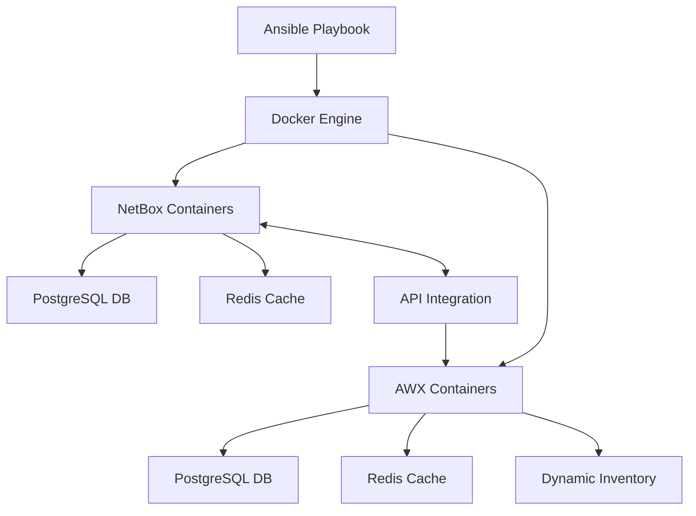

# Подробное описание Ansible Playbook для развертывания AWX и NetBox в Docker Compose

## Полная архитектура решения



## Подробная структура проекта

```
awx-netbox-integration/
├── .docker/                     # Дополнительные Docker файлы
│   ├── netbox/
│   │   ├── configuration/       # Конфиги NetBox
│   │   └── startup-scripts/     # Скрипты инициализации
│   └── awx/
│       ├── projects/            # Проекты AWX
│       └── credentials/         # Учетные данные
├── inventories/
│   └── production/
│       ├── hosts                # Инвентарь хостов
│       └── group_vars/
│           ├── all.yml          # Основные переменные
│           └── vault.yml        # Зашифрованные секреты
├── roles/
│   └── awx_netbox_docker/
│       ├── tasks/
│       │   ├── prerequisites.yml # Предварительные требования
│       │   ├── docker.yml       # Установка Docker
│       │   ├── netbox.yml       # Развертывание NetBox
│       │   ├── awx.yml          # Развертывание AWX
│       │   ├── integration.yml  # Настройка интеграции
│       │   └── post_install.yml # Пост-установочные задачи
│       ├── templates/
│       │   ├── netbox/
│       │   │   ├── docker-compose.yml.j2
│       │   │   ├── configuration.py.j2
│       │   │   └── nginx.conf.j2
│       │   └── awx/
│       │       ├── docker-compose.yml.j2
│       │       ├── inventory.py.j2
│       │       └── credentials.yml.j2
│       ├── files/
│       │   ├── netbox/          # Статические файлы NetBox
│       │   └── awx/             # Статические файлы AWX
│       └── vars/
│           └── main.yml         # Переменные по умолчанию
├── playbook.yml                 # Основной playbook
├── requirements.yml             # Зависимости
└── README.md                    # Документация
```

## Подробный playbook.yml

```yaml
---
- name: Развертывание AWX и NetBox в Docker
  hosts: "{{ target_hosts | default('management_servers') }}"
  become: true
  any_errors_fatal: true

  # Импорт переменных с проверкой
  vars_files:
    - "{{ playbook_dir }}/inventories/production/group_vars/all.yml"
    - "{{ playbook_dir }}/inventories/production/group_vars/vault.yml"

  pre_tasks:
    - name: Проверка поддерживаемой ОС
      ansible.builtin.assert:
        that:
          - ansible_distribution in ['Ubuntu', 'CentOS', 'RedHat', 'Debian']
        fail_msg: "Неподдерживаемая ОС: {{ ansible_distribution }}"
    
    - name: Проверка ресурсов сервера
      ansible.builtin.assert:
        that:
          - ansible_memtotal_mb >= 8192
          - ansible_processor_vcpus >= 4
          - ansible_facts.disks[0].size_available_gb >= 50
        fail_msg: |
          Недостаточно ресурсов:
          Память: {{ ansible_memtotal_mb }}MB (требуется 8192MB)
          CPU: {{ ansible_processor_vcpus }} (требуется 4)
          Диск: {{ ansible_facts.disks[0].size_available_gb }}GB (требуется 50GB)

  roles:
    - role: geerlingguy.docker
      vars:
        docker_users: "{{ docker_users | default([]) + [ansible_user] }}"
        docker_install_compose: true
        docker_compose_version: "{{ docker_compose_version | default('v2.23.0') }}"
      tags: docker

    - role: awx_netbox_docker
      tags: awx_netbox

  post_tasks:
    - name: Ожидание запуска NetBox
      ansible.builtin.uri:
        url: "http://localhost:{{ netbox_port }}/api/status/"
        method: GET
        status_code: 200
        timeout: 30
        body_format: json
      register: result
      until: result.status == 200 and result.json.redis is defined
      retries: 20
      delay: 10
      ignore_errors: no
      changed_when: false

    - name: Ожидание запуска AWX
      ansible.builtin.uri:
        url: "http://localhost:{{ awx_port }}/api/v2/ping/"
        method: GET
        status_code: 200
        timeout: 30
        body_format: json
      register: result
      until: result.status == 200 and result.json.ha is defined
      retries: 30
      delay: 10
      ignore_errors: no
      changed_when: false

    - name: Создание отчета о развертывании
      ansible.builtin.template:
        src: "{{ playbook_dir }}/roles/awx_netbox_docker/templates/deployment_report.j2"
        dest: "/tmp/awx_netbox_deployment_report.txt"
        mode: 0644
      delegate_to: localhost

    - name: Отображение отчета
      ansible.builtin.command: cat /tmp/awx_netbox_deployment_report.txt
      delegate_to: localhost
      register: report
      changed_when: false

    - name: Вывод информации для доступа
      ansible.builtin.debug:
        msg: "{{ report.stdout_lines }}"
```

## Подробное описание задач в роли

### tasks/prerequisites.yml

```yaml
---
- name: Установка системных зависимостей (Ubuntu/Debian)
  ansible.builtin.apt:
    pkg:
      - git
      - curl
      - python3-pip
      - python3-dev
      - libpq-dev
      - build-essential
      - apt-transport-https
      - ca-certificates
      - software-properties-common
    update_cache: yes
    cache_valid_time: 3600
  when: ansible_os_family == 'Debian'

- name: Установка системных зависимостей (CentOS/RHEL)
  ansible.builtin.yum:
    name:
      - git
      - curl
      - python3-pip
      - python3-devel
      - postgresql-devel
      - gcc
      - make
      - yum-utils
      - device-mapper-persistent-data
      - lvm2
    state: present
  when: ansible_os_family == 'RedHat'

- name: Настройка параметров системы
  ansible.builtin.sysctl:
    name: "{{ item.name }}"
    value: "{{ item.value }}"
    state: present
    reload: yes
    sysctl_file: "/etc/sysctl.d/99-awx-netbox.conf"
  loop:
    - { name: "vm.max_map_count", value: "262144" }
    - { name: "vm.swappiness", value: "1" }
    - { name: "net.ipv4.ip_local_port_range", value: "1024 65535" }
```

### tasks/netbox.yml

```yaml
---
- name: Создание директорий для NetBox
  ansible.builtin.file:
    path: "{{ item }}"
    state: directory
    mode: 0755
    owner: "{{ ansible_user }}"
    group: "{{ ansible_user }}"
  loop:
    - "{{ netbox_base_dir }}/netbox-docker"
    - "{{ netbox_base_dir }}/netbox-docker/nginx"
    - "{{ netbox_base_dir }}/netbox-docker/netbox-media"
    - "{{ netbox_base_dir }}/netbox-docker/netbox-config"

- name: Развертывание docker-compose для NetBox
  ansible.builtin.template:
    src: "netbox/docker-compose.yml.j2"
    dest: "{{ netbox_base_dir }}/netbox-docker/docker-compose.yml"
    mode: 0644

- name: Настройка конфигурации NetBox
  ansible.builtin.template:
    src: "netbox/configuration.py.j2"
    dest: "{{ netbox_base_dir }}/netbox-docker/netbox-config/configuration.py"
    mode: 0644

- name: Настройка Nginx для NetBox
  ansible.builtin.template:
    src: "netbox/nginx.conf.j2"
    dest: "{{ netbox_base_dir }}/netbox-docker/nginx/nginx.conf"
    mode: 0644

- name: Запуск NetBox контейнеров
  community.docker.docker_compose:
    project_src: "{{ netbox_base_dir }}/netbox-docker"
    build: yes
    pull: yes
    recreate: always
    state: present

- name: Инициализация NetBox
  ansible.builtin.command: >
    docker compose -f {{ netbox_base_dir }}/netbox-docker/docker-compose.yml
    exec netbox /opt/netbox/netbox/manage.py createsuperuser --noinput
    --username {{ netbox_superuser_name }}
    --email {{ netbox_superuser_email }}
  environment:
    DJANGO_SUPERUSER_PASSWORD: "{{ netbox_superuser_password }}"
  register: netbox_init
  changed_when: "'Superuser created successfully' in netbox_init.stdout"
  retries: 5
  delay: 10
  until: netbox_init.rc == 0
```

### tasks/awx.yml

```yaml
---
- name: Создание директорий для AWX
  ansible.builtin.file:
    path: "{{ item }}"
    state: directory
    mode: 0755
    owner: "{{ ansible_user }}"
    group: "{{ ansible_user }}"
  loop:
    - "{{ awx_base_dir }}/awx-docker"
    - "{{ awx_base_dir }}/awx-docker/projects"
    - "{{ awx_base_dir }}/awx-docker/credentials"

- name: Развертывание docker-compose для AWX
  ansible.builtin.template:
    src: "awx/docker-compose.yml.j2"
    dest: "{{ awx_base_dir }}/awx-docker/docker-compose.yml"
    mode: 0644

- name: Запуск AWX контейнеров
  community.docker.docker_compose:
    project_src: "{{ awx_base_dir }}/awx-docker"
    build: yes
    pull: yes
    recreate: always
    state: present

- name: Ожидание инициализации AWX
  ansible.builtin.uri:
    url: "http://localhost:{{ awx_port }}/api/v2/ping/"
    method: GET
    status_code: 200
    timeout: 30
    body_format: json
  register: result
  until: result.status == 200 and result.json.ha is defined
  retries: 30
  delay: 10
  changed_when: false
```

### tasks/integration.yml

```yaml
---
- name: Создание скрипта динамического инвентаря
  ansible.builtin.template:
    src: "awx/inventory.py.j2"
    dest: "{{ netbox_awx_inventory_script_path }}/netbox_inventory.py"
    mode: 0755

- name: Настройка API токена в NetBox
  ansible.builtin.uri:
    url: "http://localhost:{{ netbox_port }}/api/users/tokens/"
    method: POST
    headers:
      Authorization: "Token {{ netbox_superuser_api_token }}"
      Content-Type: "application/json"
    body_format: json
    body:
      user: 1  # ID суперпользователя
      key: "{{ awx_netbox_api_token }}"
      write_enabled: true
      description: "AWX Integration Token"
    status_code: 201
    timeout: 30
  register: token_create
  changed_when: token_create.status == 201
  retries: 5
  delay: 10
  until: token_create.status == 201

- name: Настройка Webhook в NetBox для AWX
  ansible.builtin.uri:
    url: "http://localhost:{{ netbox_port }}/api/extras/webhooks/"
    method: POST
    headers:
      Authorization: "Token {{ netbox_superuser_api_token }}"
      Content-Type: "application/json"
    body_format: json
    body:
      name: "AWX Integration"
      type_create: true
      type_update: true
      type_delete: true
      payload_url: "http://awx:{{ awx_port }}/api/v2/job_templates/{{ awx_webhook_template_id }}/launch/"
      http_method: "POST"
      http_content_type: "application/json"
      secret: "{{ awx_webhook_secret }}"
      ssl_verification: false
      enabled: true
      conditions: {}
    status_code: 201
    timeout: 30
  register: webhook_create
  changed_when: webhook_create.status == 201
```

## Шаблоны конфигурации

### templates/netbox/docker-compose.yml.j2

```yaml
version: '3.4'
services:
  netbox:
    image: netboxcommunity/netbox:{{ netbox_version }}
    depends_on:
      - postgres
      - redis
      - redis-cache
    ports:
      - "{{ netbox_port }}:8080"
    volumes:
      - ./netbox-config/configuration.py:/etc/netbox/config/configuration.py:ro,z
      - ./netbox-media:/opt/netbox/netbox/media:z
    environment:
      - DB_NAME={{ netbox_db_name }}
      - DB_USER={{ netbox_db_user }}
      - DB_PASSWORD={{ netbox_db_password }}
      - DB_HOST=postgres
      - DB_PORT=5432
      - REDIS_HOST=redis
      - REDIS_PORT=6379
      - REDIS_PASSWORD={{ netbox_redis_password }}
      - REDIS_CACHE_HOST=redis-cache
      - REDIS_CACHE_PORT=6379
      - REDIS_CACHE_PASSWORD={{ netbox_redis_password }}
      - SUPERUSER_NAME={{ netbox_superuser_name }}
      - SUPERUSER_EMAIL={{ netbox_superuser_email }}
      - SUPERUSER_PASSWORD={{ netbox_superuser_password }}
      - SECRET_KEY={{ netbox_secret_key }}
      - ALLOWED_HOSTS=*
    restart: unless-stopped

  postgres:
    image: postgres:15-alpine
    environment:
      - POSTGRES_DB={{ netbox_db_name }}
      - POSTGRES_USER={{ netbox_db_user }}
      - POSTGRES_PASSWORD={{ netbox_db_password }}
    volumes:
      - netbox-postgres-data:/var/lib/postgresql/data
    restart: unless-stopped

  redis:
    image: redis:7-alpine
    command: redis-server --requirepass {{ netbox_redis_password }}
    volumes:
      - netbox-redis-data:/data
    restart: unless-stopped

  redis-cache:
    image: redis:7-alpine
    command: redis-server --requirepass {{ netbox_redis_password }}
    volumes:
      - netbox-redis-cache-data:/data
    restart: unless-stopped

  nginx:
    image: nginx:1.25-alpine
    ports:
      - "80:8080"
    volumes:
      - ./nginx/nginx.conf:/etc/nginx/nginx.conf:ro
      - ./netbox-media:/opt/netbox/netbox/media:ro
    depends_on:
      - netbox
    restart: unless-stopped

volumes:
  netbox-postgres-data:
  netbox-redis-data:
  netbox-redis-cache-data:
```

## Запуск и управление

1. **Инициализация**:
```bash
ansible-playbook -i inventories/production/ playbook.yml
```

2. **Обновление контейнеров**:
```bash
ansible-playbook -i inventories/production/ playbook.yml --tags docker,awx,netbox
```

3. **Обновление только интеграции**:
```bash
ansible-playbook -i inventories/production/ playbook.yml --tags integration
```

4. **Ручное управление сервисами**:
```bash
# NetBox
cd /opt/netbox-docker && docker compose up -d

# AWX
cd /opt/awx-docker && docker compose up -d
```

## Мониторинг и логи

```bash
# Логи NetBox
docker compose -f /opt/netbox-docker/docker-compose.yml logs -f netbox

# Логи AWX
docker compose -f /opt/awx-docker/docker-compose.yml logs -f awx

# Статус контейнеров
docker ps --format "table {{.Names}}\t{{.Status}}\t{{.Ports}}"
```

## Рекомендации по эксплуатации

1. **Резервное копирование**:
   - Регулярно бэкапируйте volumes PostgreSQL
   - Сохраняйте конфигурационные файлы

2. **Масштабирование**:
   - Для production окружения добавьте реплики Redis
   - Рассмотрите отдельные серверы для БД

3. **Безопасность**:
   - Настройте HTTPS через reverse proxy
   - Ограничьте доступ к API
   - Регулярно обновляйте контейнеры

4. **Интеграции**:
   - Настройте LDAP/AD аутентификацию
   - Добавьте мониторинг через Prometheus
   - Интегрируйте с системами ticketing (Jira, ServiceNow)